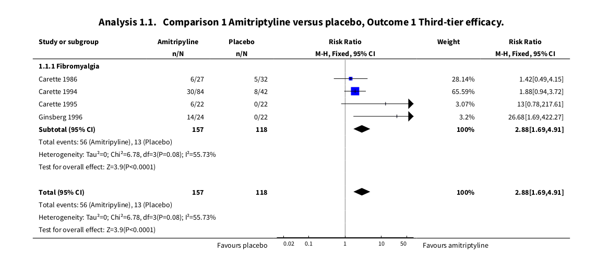

```{r setup, include=FALSE}
knitr::opts_chunk$set(echo = FALSE)
```

```{r pkgs}
# packages used in this analysis
library(tidyverse)
library(meta)
library(gt)
library(skimr)
library(metafor)
library(targets)
library(multinma)

```


These analyses aim to replicate, reproduce, and extend on the analyses presented in a previous Cochrane review on the treatment of fibromyalgia with amitriptyline [@moore_2015]. 

# Replication

This replication uses the original data provided with the review.

```{r}
# convert data from RevMan

fib_ami_dat_raw <- read.rm5("data/fibromyalgia-amitriptyline.rm5") %>% 
    janitor::clean_names() 

# tidy it up a bit
fib_ami_dat <-
  fib_ami_dat_raw %>% 
  rename(study = studlab, outcome =  outclab) %>% 
  select(study, event_c, event_e, n_c, n_e, outcome)   
```

Our objective is to replicate the results shown in this analysis.

```{r l-screen}

```

The point estimates and confidence intervals for the studies in our analysis perfectly replicated. However, the point estimate and confidence interval for the overall effect does differ somewhat due to minutiae in the implementation of the Mantel-Haenszel method [@viechtbauer_2019]. As we use use a random-effects meta-analysis method for our sensitivity analyses, it is sufficient for our objective here of replication.  

```{r}
third_tier_dat <- 
  fib_ami_dat %>% 
  filter(str_detect(outcome, "Third-tier efficacy"))


third_tier_escalc <-
  third_tier_dat %>%
  # does adding the complement help?
  mutate(comp_c = n_c - event_c, comp_e = n_e - event_e) %>%
  escalc(
    measure = "RR",
    ai = event_e,
    bi = comp_e,
    n1i = n_e,
    ci = event_c,
    di = comp_c,
    n2i = n_c,
    dat = .
  ) 

third_tier_mh <- 
  rma.mh(
    slab = study,
        measure = "RR",
    ai = event_e,
    bi = comp_e,
    n1i = n_e,
    ci = event_c,
    di = comp_c,
    n2i = n_c,
    data = third_tier_dat %>%   
      mutate(comp_c = n_c - event_c, comp_e = n_e - event_e),
    add = 1/2
  )  

summary(third_tier_mh)
```

The R implementation of the Mantel-Haenszel method has different visualisation defaults. 

```{r}
forest(third_tier_mh, transf = exp, refline = 1)

```

We can set the limits of the x-axis to the same as presented in the original RevMan plot, but it causes the labels to go awry. 

```{r}
forest(third_tier_mh, 
       transf = exp, 
       refline = 1, 
       alim = c(-1, 50), 
       xlim = c(-1, 50))

```

# Reproduction

```{r}
pain_sub_dat <- 
  tar_read(w_obs) %>% 
  dplyr::filter(
    condition == "fibromyalgia" | 
      condition_general == "fibromyalgia" |
      condition_iasp == "fibromyalgia"
  ) %>% 
  dplyr::filter(
    outcome == "pain_sub",
    str_detect(type, "antidepressant|placebo"),
    str_detect(intervention, "amitriptyline|placebo"),
    str_detect(design, "parallel"),
    timepoint == "post_int"
  )   


```

```{r}
pain_sub_dat %>% 
  select(study, outcome, r, n, intervention) 

```


```{r}
# read in the data hollie prepped for this analysis
hpp_moore_dat <- 
  read_csv("data/outcomes-2021-08-16/Andrew's amitriptyline review - test data.csv")

```

We have these data! Our real challenge is whether we extract the 50% substantial pain for the *other* studies in our review. 

Moore data from revman.

```{r}
# Moore data 

third_tier_dat


```

Current extraction for replication.

```{r}
# Hollie's extraction

hpp_moore_dat

```


I'll try to explain this better with tables. 

```{r}
tar_read(w_obs) %>% 
  group_by(outcome) %>% 
  dplyr::filter(
    condition == "fibromyalgia" | 
      condition_general == "fibromyalgia" |
      condition_iasp == "fibromyalgia"
  ) %>% 
  dplyr::filter(
    str_detect(type, "antidepressant|placebo"),
    str_detect(intervention, "amitriptyline|placebo"),
    str_detect(design, "parallel"),
    str_detect(outcome, "pain")
  ) %>% 
  select(study, contains("condition"), arm, mean, sd, r, n) %>% 
  skim()

```

