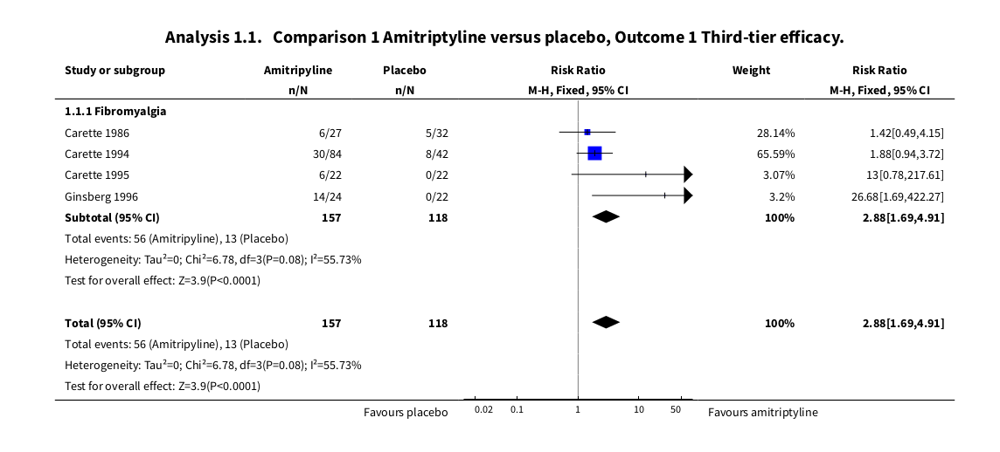

```{r setup, include=FALSE}
knitr::opts_chunk$set(echo = TRUE)
```

> Current draft for discussion with Tamar, Gav, and Hollie. Will cut down for presentation to whole group.

## packages

```{r pkgs}
library(meta)
library(gt)
library(tidyverse)
library(skimr)
library(metafor)
library(targets)
library(multinma)

source("R/hpp_themes.R")

```

# replication of amitriptyline and fibromyalgia

In this section I replicate the substantial pain reduction findings of Moore *et al.* [@moore_2015].

## notes

Objective: measure efficacy of analgesic efficacy and adverse events of amitriptyline on pain in fibromyalgia patients.

### Three tiers of evidence

> Possibly should incorporate these as variables into our analysis.

#### First tier

-   Study design follows current best standards
-   Minimal risk of bias
-   Outcome equivalent to substantial pain reduction
-   Intention to treat without inputation for dropouts (not sure what this means)
-   $\geqslant$ 200 participants in comparison; i.e., total sample size across arms
-   8-12 weeks duration
-   parallel design

#### Second tier

-   Failed to meet 1 or more items in First tier
-   At risk of bias

#### Third tier

Only third-tier studies were found in the review

-   Small number of participants
-   Likely to be biased
-   Outcomes of limited clinical utility

## Outcomes

Analgesic efficacy: NNT (number needed to treat)

Harm: NNH number heeded to treat to harm

> This is only important for transformation in the summary of findings, that is, after the model's log risk ratios have been calculated. Not important for model. Importantly, to calculate NNT and NNH, we require a something somehting.

## Model notes

Risk ratio of 50% pain relief using a fixed-effect meta-analysis

## Results

-   9 studies, 2 with cross-over design
-   649 participants
-   6-12 weeks duration
-   25mg and 50mg dosages

## import data from revman format

```{r import moore data}
fib_ami_dat_raw <- read.rm5("data/fibromyalgia-amitriptyline.rm5") %>% 
    janitor::clean_names() 

# tidy it up a bit
fib_ami_dat <-
  fib_ami_dat_raw %>% 
  rename(study = studlab, outcome =  outclab) %>% 
  select(study, event_c, event_e, n_c, n_e, outcome)   

```

## third-tier efficacy

Our objective is to replicate the results shown in this analysis.

```{r}

```

```{r}
third_tier_dat <- 
  fib_ami_dat %>% 
  filter(str_detect(outcome, "Third-tier efficacy"))
  
third_tier_dat %>% 
  gt(groupname_col = "outcome") %>% 
  hpp_tab(vertical_divider = "study") %>% 
  tab_header("Studies included in third-tier efficacy analysis")
  
```

```{r}
third_tier_escalc <-
  third_tier_dat %>%
  # does adding the complement help?
  mutate(comp_c = n_c - event_c, comp_e = n_e - event_e) %>%
  escalc(
    measure = "RR",
    ai = event_e,
    bi = comp_e,
    n1i = n_e,
    ci = event_c,
    di = comp_c,
    n2i = n_c,
    dat = .
  ) 
  
third_tier_rma <-   
  rma(
    yi = yi,
    vi = vi,
    slab = study,
    data = third_tier_escalc
  )


third_tier_mh <- 
  rma.mh(
    slab = study,
        measure = "RR",
    ai = event_e,
    bi = comp_e,
    n1i = n_e,
    ci = event_c,
    di = comp_c,
    n2i = n_c,
    data = third_tier_dat %>%   
      mutate(comp_c = n_c - event_c, comp_e = n_e - event_e),
    add = 1/2
  )  


forest(third_tier_mh, transf = exp)

```

Of course, Gav and I would likely do a random-effects model for this analysis, the results of which will likely adhere better to the NMA.

```{r}
forest(third_tier_rma, transf = exp)


```

# reproduction of amitriptyline and fibromyalgia

> Discuss with Hollie why Carette 1995 is omitted from the review.

```{r}
tar_read(w_covidence) %>% 
  filter(str_detect(study, "care|gins")) %>% 
  count(study)


```

```{r}
tar_load(w_obs)

```

## reproduction of third-tier analysis

```{r}

# number of studies per outcome
tar_read(w_obs_long) %>% 
  group_by(outcome) %>% 
  summarise(studies = n_distinct(study))


# outcomes that have carette and ginsberg 
tar_read(w_obs_long) %>% 
  filter(str_detect(study, "caret|gins")) %>%
  count(outcome, study)
```


> Discuss with Hollie scale labelling of Carette 1986; is analog scale 1-10 the same as vas?

```{r}
neuropathic_dat <- 
w_obs %>% 
  filter(condition_general == "fibromyalgia", 
         str_detect(arm, "placebo|amitrip")) %>%
  group_by(outcome, study) %>% 
  mutate(arms_per_study = 1:n()) %>% 
  filter(max(arms_per_study) > 1) %>% 
  # select(-arms_per_study) %>% 
  ungroup()

```


```{r}
# look for studies
neuropathic_dat %>% 
  filter(str_detect(study, "care|gins"), str_detect(outcome, "pain")) %>% 
  select(outcome, study) %>% 
  distinct()

```

```{r}
three_studies_dat <- 
neuropathic_dat %>% 
  filter(str_detect(study, "care|gins"), str_detect(outcome, "pain")) %>% 
  select(study, arm, covidence, scale, mean, n, sd, intervention, type)


```

> Look into multilevel variance-covariance matrix structure

```{r}
three_studies_dat %>% 
  filter(type != "placebo") %>% 
  left_join(
    three_studies_dat %>% 
      filter(type == "placebo") %>% 
      select(study, covidence, mean_p = mean, n_p = n, sd_p = sd),
    by = c("study", "covidence")
  ) %>% 
  escalc(
    m1i = mean,
    sd1i = sd,
    n1i = n,
    m2i = mean_p,
    sd2i = sd_p,
    n2i = n_p,
    measure = "SMD",
    data = .,
    slab = study
  ) %>% 
  rma.mv(
    yi,
    vi,
    random = ~ 1 | study/covidence,
    data = .
  ) %>% forest()


```


## reproduction with all studies

```{r}
all_dat <- neuropathic_dat %>% 
  filter(str_detect(outcome, "pain")) %>% 
  select(study, arm, covidence, scale, mean, n, sd, intervention, type) 

all_dat_rma <- 
all_dat %>% 
  filter(type != "placebo") %>% 
  left_join(
    all_dat %>% 
      filter(type == "placebo") %>% 
      select(study, covidence, mean_p = mean, n_p = n, sd_p = sd),
    by = c("study", "covidence")
  ) %>% 
  escalc(
    m1i = mean,
    sd1i = sd,
    n1i = n,
    m2i = mean_p,
    sd2i = sd_p,
    n2i = n_p,
    measure = "SMD",
    data = .,
    slab = study
  ) %>% 
  rma.mv(
    yi = yi,
    V = vi,
    random = ~ 1 |study/ covidence,
    data = .
  ) 


summary(all_dat_rma)

forest(all_dat_rma)

```

# extension

Now we'll try network meta-analysis. Again, we have to solve the multi-level thing.

## nma of fibromyalgia

```{r}
# get fibromyalgia data
fibro_dat <- 
w_obs %>% 
  filter(condition_general == "fibromyalgia") %>%
  group_by(outcome, study) %>% 
  mutate(arms_per_study = 1:n()) %>% 
  filter(max(arms_per_study) > 1) %>% 
  # select(-arms_per_study) %>% 
  ungroup()

```


```{r}
# outcomes
fibro_dat %>% 
  count(outcome) %>% 
  gt()


```

### pain nma

```{r}
pain_sub_net <- 
  set_agd_arm(
  data = fibro_dat %>% filter(outcome == "pain_sub"),
  trt = intervention,
  r = r,
  n = n,
  sample_size = n,
  trt_ref = "placebo",
  study = study
) 

plot(pain_sub_net)


```


```{r include=FALSE}

pain_sub_rma <-
nma(
  pain_sub_net,
  trt_effects = "random"
)


```


```{r}
pain_int_net <- 
  set_agd_arm(
  data = fibro_dat %>% filter(outcome == "pain_int"),
  trt = intervention,
  y = mean,
  se = se,
  sample_size = n,
  trt_ref = "placebo",
  study = study
) 

pain_int_net

plot(pain_int_net)

```

```{r include = FALSE}

pain_int_rma <-
nma(pain_int_net, trt_effects = "random")

```


```{r}
print(pain_int_rma)

relative_effects(pain_int_rma) %>% 
  plot()

```

```{r}
# gussy up the plot a bit
summary(pain_int_rma) %>% 
  as_tibble()

```


