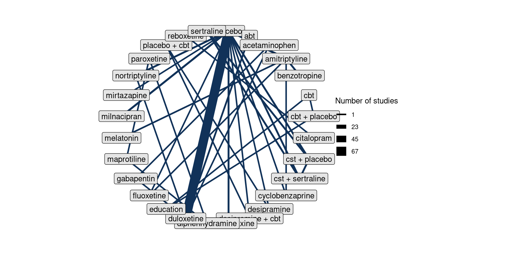
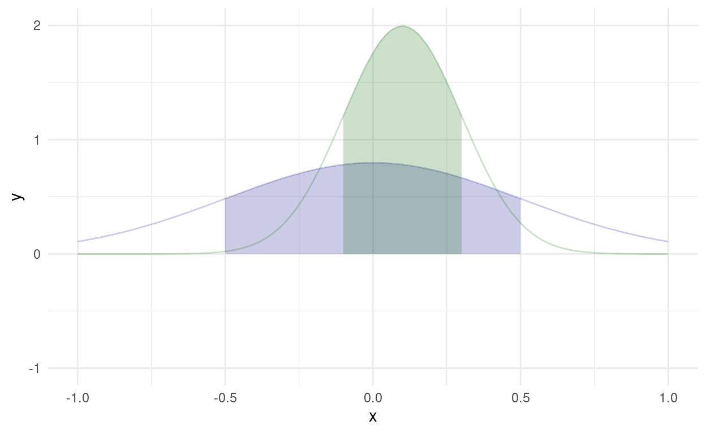

<div class="layout-chunk" data-layout="l-body">


</div>


<div class="layout-chunk" data-layout="l-body">


</div>


<div class="layout-chunk" data-layout="l-body">


</div>


## network and model

Network meta-analysis provides a means of aggregating and comparing the results of all studies examining the effect of antidepressants on pain.

We now define the parameters of the model for the pain outcome, using White *et al.*'s notation.

Let $i = 1, \dots, n$ denote the study, and $k = 1, \dots, K$ denote the treatment. 

Let $R_i$ be the set of treatments in study $i$, which we call the study design. 

Let $\theta_{ik}^a$ be the parameter of interest in arm $k$ of study $i$ [@white2019].

Let $y_{ik}^a$ denote the observed effect for arm $k$ of study $i$. 


### arm-based likelihood

Arm-based likelihood is 

<div class="layout-chunk" data-layout="l-body">


</div>


### contrast-based likelihood

## model results

<div class="layout-chunk" data-layout="l-body">


</div>


<div class="layout-chunk" data-layout="l-body">


</div>


## pairwise analyses

Individual analyses for each treatment, compared with placebo.

-   [ ] adapt notation to our problem

### why do pairwise

### pairwise meta-analysis

We want to fit a pairwise meta-analysis for each treatment, with concise summaries, as well as in-depth supplementary material. We split the analysis into two components, as the number of interventions per outcome is considerable, see below Table, in some cases, according to recommendations in Section 11.6.4 of the Handbook [@higgins2019cochrane].

<div class="layout-chunk" data-layout="l-body">


</div>


<div class="layout-chunk" data-layout="l-body">

```{=html}
<style>html {
  font-family: -apple-system, BlinkMacSystemFont, 'Segoe UI', Roboto, Oxygen, Ubuntu, Cantarell, 'Helvetica Neue', 'Fira Sans', 'Droid Sans', Arial, sans-serif;
}

#gfjuiyetxs .gt_table {
  display: table;
  border-collapse: collapse;
  margin-left: auto;
  margin-right: auto;
  color: #333333;
  font-size: 16px;
  font-weight: normal;
  font-style: normal;
  background-color: #FFFFFF;
  width: auto;
  border-top-style: solid;
  border-top-width: 2px;
  border-top-color: #A8A8A8;
  border-right-style: none;
  border-right-width: 2px;
  border-right-color: #D3D3D3;
  border-bottom-style: solid;
  border-bottom-width: 2px;
  border-bottom-color: #A8A8A8;
  border-left-style: none;
  border-left-width: 2px;
  border-left-color: #D3D3D3;
}

#gfjuiyetxs .gt_heading {
  background-color: #FFFFFF;
  text-align: center;
  border-bottom-color: #FFFFFF;
  border-left-style: none;
  border-left-width: 1px;
  border-left-color: #D3D3D3;
  border-right-style: none;
  border-right-width: 1px;
  border-right-color: #D3D3D3;
}

#gfjuiyetxs .gt_title {
  color: #333333;
  font-size: 125%;
  font-weight: initial;
  padding-top: 4px;
  padding-bottom: 4px;
  border-bottom-color: #FFFFFF;
  border-bottom-width: 0;
}

#gfjuiyetxs .gt_subtitle {
  color: #333333;
  font-size: 85%;
  font-weight: initial;
  padding-top: 0;
  padding-bottom: 4px;
  border-top-color: #FFFFFF;
  border-top-width: 0;
}

#gfjuiyetxs .gt_bottom_border {
  border-bottom-style: solid;
  border-bottom-width: 2px;
  border-bottom-color: #D3D3D3;
}

#gfjuiyetxs .gt_col_headings {
  border-top-style: solid;
  border-top-width: 2px;
  border-top-color: #D3D3D3;
  border-bottom-style: solid;
  border-bottom-width: 2px;
  border-bottom-color: #D3D3D3;
  border-left-style: none;
  border-left-width: 1px;
  border-left-color: #D3D3D3;
  border-right-style: none;
  border-right-width: 1px;
  border-right-color: #D3D3D3;
}

#gfjuiyetxs .gt_col_heading {
  color: #333333;
  background-color: #FFFFFF;
  font-size: 100%;
  font-weight: normal;
  text-transform: inherit;
  border-left-style: none;
  border-left-width: 1px;
  border-left-color: #D3D3D3;
  border-right-style: none;
  border-right-width: 1px;
  border-right-color: #D3D3D3;
  vertical-align: bottom;
  padding-top: 5px;
  padding-bottom: 6px;
  padding-left: 5px;
  padding-right: 5px;
  overflow-x: hidden;
}

#gfjuiyetxs .gt_column_spanner_outer {
  color: #333333;
  background-color: #FFFFFF;
  font-size: 100%;
  font-weight: normal;
  text-transform: inherit;
  padding-top: 0;
  padding-bottom: 0;
  padding-left: 4px;
  padding-right: 4px;
}

#gfjuiyetxs .gt_column_spanner_outer:first-child {
  padding-left: 0;
}

#gfjuiyetxs .gt_column_spanner_outer:last-child {
  padding-right: 0;
}

#gfjuiyetxs .gt_column_spanner {
  border-bottom-style: solid;
  border-bottom-width: 2px;
  border-bottom-color: #D3D3D3;
  vertical-align: bottom;
  padding-top: 5px;
  padding-bottom: 6px;
  overflow-x: hidden;
  display: inline-block;
  width: 100%;
}

#gfjuiyetxs .gt_group_heading {
  padding: 8px;
  color: #333333;
  background-color: #FFFFFF;
  font-size: 100%;
  font-weight: initial;
  text-transform: inherit;
  border-top-style: solid;
  border-top-width: 2px;
  border-top-color: #D3D3D3;
  border-bottom-style: solid;
  border-bottom-width: 2px;
  border-bottom-color: #D3D3D3;
  border-left-style: none;
  border-left-width: 1px;
  border-left-color: #D3D3D3;
  border-right-style: none;
  border-right-width: 1px;
  border-right-color: #D3D3D3;
  vertical-align: middle;
}

#gfjuiyetxs .gt_empty_group_heading {
  padding: 0.5px;
  color: #333333;
  background-color: #FFFFFF;
  font-size: 100%;
  font-weight: initial;
  border-top-style: solid;
  border-top-width: 2px;
  border-top-color: #D3D3D3;
  border-bottom-style: solid;
  border-bottom-width: 2px;
  border-bottom-color: #D3D3D3;
  vertical-align: middle;
}

#gfjuiyetxs .gt_from_md > :first-child {
  margin-top: 0;
}

#gfjuiyetxs .gt_from_md > :last-child {
  margin-bottom: 0;
}

#gfjuiyetxs .gt_row {
  padding-top: 8px;
  padding-bottom: 8px;
  padding-left: 5px;
  padding-right: 5px;
  margin: 10px;
  border-top-style: solid;
  border-top-width: 1px;
  border-top-color: #D3D3D3;
  border-left-style: none;
  border-left-width: 1px;
  border-left-color: #D3D3D3;
  border-right-style: none;
  border-right-width: 1px;
  border-right-color: #D3D3D3;
  vertical-align: middle;
  overflow-x: hidden;
}

#gfjuiyetxs .gt_stub {
  color: #333333;
  background-color: #FFFFFF;
  font-size: 100%;
  font-weight: initial;
  text-transform: inherit;
  border-right-style: solid;
  border-right-width: 2px;
  border-right-color: #D3D3D3;
  padding-left: 12px;
}

#gfjuiyetxs .gt_summary_row {
  color: #333333;
  background-color: #FFFFFF;
  text-transform: inherit;
  padding-top: 8px;
  padding-bottom: 8px;
  padding-left: 5px;
  padding-right: 5px;
}

#gfjuiyetxs .gt_first_summary_row {
  padding-top: 8px;
  padding-bottom: 8px;
  padding-left: 5px;
  padding-right: 5px;
  border-top-style: solid;
  border-top-width: 2px;
  border-top-color: #D3D3D3;
}

#gfjuiyetxs .gt_grand_summary_row {
  color: #333333;
  background-color: #FFFFFF;
  text-transform: inherit;
  padding-top: 8px;
  padding-bottom: 8px;
  padding-left: 5px;
  padding-right: 5px;
}

#gfjuiyetxs .gt_first_grand_summary_row {
  padding-top: 8px;
  padding-bottom: 8px;
  padding-left: 5px;
  padding-right: 5px;
  border-top-style: double;
  border-top-width: 6px;
  border-top-color: #D3D3D3;
}

#gfjuiyetxs .gt_striped {
  background-color: rgba(128, 128, 128, 0.05);
}

#gfjuiyetxs .gt_table_body {
  border-top-style: solid;
  border-top-width: 2px;
  border-top-color: #D3D3D3;
  border-bottom-style: solid;
  border-bottom-width: 2px;
  border-bottom-color: #D3D3D3;
}

#gfjuiyetxs .gt_footnotes {
  color: #333333;
  background-color: #FFFFFF;
  border-bottom-style: none;
  border-bottom-width: 2px;
  border-bottom-color: #D3D3D3;
  border-left-style: none;
  border-left-width: 2px;
  border-left-color: #D3D3D3;
  border-right-style: none;
  border-right-width: 2px;
  border-right-color: #D3D3D3;
}

#gfjuiyetxs .gt_footnote {
  margin: 0px;
  font-size: 90%;
  padding: 4px;
}

#gfjuiyetxs .gt_sourcenotes {
  color: #333333;
  background-color: #FFFFFF;
  border-bottom-style: none;
  border-bottom-width: 2px;
  border-bottom-color: #D3D3D3;
  border-left-style: none;
  border-left-width: 2px;
  border-left-color: #D3D3D3;
  border-right-style: none;
  border-right-width: 2px;
  border-right-color: #D3D3D3;
}

#gfjuiyetxs .gt_sourcenote {
  font-size: 90%;
  padding: 4px;
}

#gfjuiyetxs .gt_left {
  text-align: left;
}

#gfjuiyetxs .gt_center {
  text-align: center;
}

#gfjuiyetxs .gt_right {
  text-align: right;
  font-variant-numeric: tabular-nums;
}

#gfjuiyetxs .gt_font_normal {
  font-weight: normal;
}

#gfjuiyetxs .gt_font_bold {
  font-weight: bold;
}

#gfjuiyetxs .gt_font_italic {
  font-style: italic;
}

#gfjuiyetxs .gt_super {
  font-size: 65%;
}

#gfjuiyetxs .gt_footnote_marks {
  font-style: italic;
  font-size: 65%;
}
</style>
<div id="gfjuiyetxs" style="overflow-x:auto;overflow-y:auto;width:auto;height:auto;"><table class="gt_table">
  <thead class="gt_header">
    <tr>
      <th colspan="3" class="gt_heading gt_title gt_font_normal" style>Number of studies and interventions, by outcome</th>
    </tr>
    <tr>
      <th colspan="3" class="gt_heading gt_subtitle gt_font_normal gt_bottom_border" style>Interventions include placebo, as sometimes there are more than one type of placebo</th>
    </tr>
  </thead>
  <thead class="gt_col_headings">
    <tr>
      <th class="gt_col_heading gt_columns_bottom_border gt_left" rowspan="1" colspan="1">Outcome</th>
      <th class="gt_col_heading gt_columns_bottom_border gt_center" rowspan="1" colspan="1">Number of studies</th>
      <th class="gt_col_heading gt_columns_bottom_border gt_center" rowspan="1" colspan="1">Number of interventions</th>
    </tr>
  </thead>
  <tbody class="gt_table_body">
    <tr>
      <td class="gt_row gt_left">substantial pain</td>
      <td class="gt_row gt_center">4</td>
      <td class="gt_row gt_center">5</td>
    </tr>
    <tr>
      <td class="gt_row gt_left">pain</td>
      <td class="gt_row gt_center">44</td>
      <td class="gt_row gt_center">28</td>
    </tr>
    <tr>
      <td class="gt_row gt_left">mood</td>
      <td class="gt_row gt_center">61</td>
      <td class="gt_row gt_center">42</td>
    </tr>
  </tbody>
  
  
</table></div>
```

</div>


### pairwise model

To avoid confusion, we need to state the pairwise models being fun using the same notation as we use for the network meta-analysis models. 

Here we consider a subset of data for $j$, that is for only one outcome, $j'$, so that we expect the same as above except we fix the index, so that $y^a_{j = j'|ki}$. 

$$
d_i \sim N(\delta_i, \sigma^2)\\
\delta_{i} \sim N(\delta, \tau^2)
$$
Given the data, what description of the data is most plausible, if we define the components of the data as follows? We assume a random-effects structure, which is to say, we can approximate, with a measurable degree of plausibility, the expected value of a standardised mean difference $d_i$ of an outcome $j'$ of interest for a study $i$ and antidepressant treatment $k$, as compared with placebo. We assume there is variability introduced by the study design $\tau^2$, as well as sampling error $\sigma^2$.  

<div class="layout-chunk" data-layout="l-body">


</div>


<div class="layout-chunk" data-layout="l-body">


</div>


## input: design matrix 

<div class="layout-chunk" data-layout="l-body">

```
A random effects NMA with a normal likelihood (identity link).
Inference for Stan model: normal.
4 chains, each with iter=2000; warmup=1000; thin=1; 
post-warmup draws per chain=1000, total post-warmup draws=4000.

                        mean se_mean    sd    2.5%     25%     50%
d[abt]                 -0.15    0.03  0.69   -1.54   -0.61   -0.15
d[acetaminophen]       28.11    0.05  2.33   23.61   26.55   28.06
d[amitriptyline]       -0.77    0.02  0.51   -1.75   -1.11   -0.77
d[benzotropine]         7.42    0.06  2.87    1.75    5.49    7.38
d[cbt]                 -0.16    0.20  5.88  -11.51   -4.22   -0.15
d[cbt + placebo]        0.31    0.20  5.84  -11.16   -3.61    0.28
d[citalopram]           0.18    0.20  7.04  -13.59   -4.53    0.18
d[cst + placebo]       -1.27    0.07  2.86   -6.75   -3.20   -1.26
d[cst + sertraline]    -2.88    0.07  2.66   -8.06   -4.73   -2.94
d[cyclobenzaprine]     -0.61    0.03  0.99   -2.58   -1.27   -0.62
d[desipramine]         -1.09    0.04  1.68   -4.33   -2.25   -1.11
d[desipramine + cbt]    0.06    0.04  1.64   -3.21   -1.02    0.09
d[desvenlafaxine]      -0.74    0.04  0.86   -2.42   -1.31   -0.75
d[diphenhydramine]      0.27    0.21  5.97  -11.48   -3.84    0.35
d[duloxetine]          -0.59    0.03  0.23   -1.05   -0.75   -0.60
d[education]            1.01    0.20  5.86  -10.30   -2.97    0.97
d[fluoxetine]          -0.63    0.03  0.99   -2.60   -1.28   -0.60
d[gabapentin]          -2.90    0.05  1.96   -6.70   -4.20   -2.95
d[maprotiline]         -0.60    0.20  5.97  -12.38   -4.71   -0.58
d[melatonin]           -1.67    0.12  5.38  -12.13   -5.21   -1.72
d[milnacipran]         -0.99    0.02  0.65   -2.27   -1.44   -0.99
d[mirtazapine]         -0.42    0.02  1.07   -2.47   -1.13   -0.41
d[nortriptyline]        2.00    0.02  1.04   -0.05    1.31    2.01
d[paroxetine]           0.78    0.20  5.93  -11.18   -3.24    0.86
d[placebo + cbt]       -1.03    0.04  1.67   -4.29   -2.15   -1.01
d[reboxetine]           0.52    0.20  7.04  -13.00   -4.20    0.48
d[sertraline]          -6.20    0.07  2.47  -11.12   -7.84   -6.19
lp__                 -670.03    0.42 10.71 -691.75 -676.97 -669.84
tau                     1.08    0.01  0.12    0.88    1.00    1.08
                         75%   97.5% n_eff Rhat
d[abt]                  0.32    1.18   750 1.01
d[acetaminophen]       29.68   32.67  2405 1.00
d[amitriptyline]       -0.42    0.21   781 1.01
d[benzotropine]         9.40   13.19  2715 1.00
d[cbt]                  3.78   11.51   859 1.00
d[cbt + placebo]        4.15   11.90   869 1.00
d[citalopram]           4.86   14.23  1245 1.00
d[cst + placebo]        0.64    4.41  1533 1.00
d[cst + sertraline]    -1.08    2.29  1385 1.00
d[cyclobenzaprine]      0.06    1.27  1228 1.00
d[desipramine]          0.03    2.22  1527 1.00
d[desipramine + cbt]    1.16    3.29  1561 1.00
d[desvenlafaxine]      -0.19    1.03   607 1.00
d[diphenhydramine]      4.39   11.57   842 1.00
d[duloxetine]          -0.43   -0.13    63 1.09
d[education]            4.95   12.47   845 1.00
d[fluoxetine]           0.04    1.29  1493 1.00
d[gabapentin]          -1.59    0.90  1718 1.00
d[maprotiline]          3.49   11.03   884 1.00
d[melatonin]            1.89    9.26  1944 1.00
d[milnacipran]         -0.55    0.29   917 1.01
d[mirtazapine]          0.30    1.63  1908 1.00
d[nortriptyline]        2.70    4.03  1857 1.00
d[paroxetine]           4.76   12.23   856 1.00
d[placebo + cbt]        0.07    2.29  1528 1.00
d[reboxetine]           5.38   14.68  1242 1.00
d[sertraline]          -4.51   -1.46  1310 1.00
lp__                 -662.61 -649.98   643 1.01
tau                     1.16    1.33   350 1.01

Samples were drawn using NUTS(diag_e) at Tue Apr 20 02:58:07 2021.
For each parameter, n_eff is a crude measure of effective sample size,
and Rhat is the potential scale reduction factor on split chains (at 
convergence, Rhat=1).
```

</div>


## output

<div class="layout-chunk" data-layout="l-body">

```
A random effects NMA with a normal likelihood (identity link).
Inference for Stan model: normal.
4 chains, each with iter=2000; warmup=1000; thin=1; 
post-warmup draws per chain=1000, total post-warmup draws=4000.

                        mean se_mean    sd    2.5%     25%     50%
d[abt]                 -0.15    0.03  0.69   -1.54   -0.61   -0.15
d[acetaminophen]       28.11    0.05  2.33   23.61   26.55   28.06
d[amitriptyline]       -0.77    0.02  0.51   -1.75   -1.11   -0.77
d[benzotropine]         7.42    0.06  2.87    1.75    5.49    7.38
d[cbt]                 -0.16    0.20  5.88  -11.51   -4.22   -0.15
d[cbt + placebo]        0.31    0.20  5.84  -11.16   -3.61    0.28
d[citalopram]           0.18    0.20  7.04  -13.59   -4.53    0.18
d[cst + placebo]       -1.27    0.07  2.86   -6.75   -3.20   -1.26
d[cst + sertraline]    -2.88    0.07  2.66   -8.06   -4.73   -2.94
d[cyclobenzaprine]     -0.61    0.03  0.99   -2.58   -1.27   -0.62
d[desipramine]         -1.09    0.04  1.68   -4.33   -2.25   -1.11
d[desipramine + cbt]    0.06    0.04  1.64   -3.21   -1.02    0.09
d[desvenlafaxine]      -0.74    0.04  0.86   -2.42   -1.31   -0.75
d[diphenhydramine]      0.27    0.21  5.97  -11.48   -3.84    0.35
d[duloxetine]          -0.59    0.03  0.23   -1.05   -0.75   -0.60
d[education]            1.01    0.20  5.86  -10.30   -2.97    0.97
d[fluoxetine]          -0.63    0.03  0.99   -2.60   -1.28   -0.60
d[gabapentin]          -2.90    0.05  1.96   -6.70   -4.20   -2.95
d[maprotiline]         -0.60    0.20  5.97  -12.38   -4.71   -0.58
d[melatonin]           -1.67    0.12  5.38  -12.13   -5.21   -1.72
d[milnacipran]         -0.99    0.02  0.65   -2.27   -1.44   -0.99
d[mirtazapine]         -0.42    0.02  1.07   -2.47   -1.13   -0.41
d[nortriptyline]        2.00    0.02  1.04   -0.05    1.31    2.01
d[paroxetine]           0.78    0.20  5.93  -11.18   -3.24    0.86
d[placebo + cbt]       -1.03    0.04  1.67   -4.29   -2.15   -1.01
d[reboxetine]           0.52    0.20  7.04  -13.00   -4.20    0.48
d[sertraline]          -6.20    0.07  2.47  -11.12   -7.84   -6.19
lp__                 -670.03    0.42 10.71 -691.75 -676.97 -669.84
tau                     1.08    0.01  0.12    0.88    1.00    1.08
                         75%   97.5% n_eff Rhat
d[abt]                  0.32    1.18   750 1.01
d[acetaminophen]       29.68   32.67  2405 1.00
d[amitriptyline]       -0.42    0.21   781 1.01
d[benzotropine]         9.40   13.19  2715 1.00
d[cbt]                  3.78   11.51   859 1.00
d[cbt + placebo]        4.15   11.90   869 1.00
d[citalopram]           4.86   14.23  1245 1.00
d[cst + placebo]        0.64    4.41  1533 1.00
d[cst + sertraline]    -1.08    2.29  1385 1.00
d[cyclobenzaprine]      0.06    1.27  1228 1.00
d[desipramine]          0.03    2.22  1527 1.00
d[desipramine + cbt]    1.16    3.29  1561 1.00
d[desvenlafaxine]      -0.19    1.03   607 1.00
d[diphenhydramine]      4.39   11.57   842 1.00
d[duloxetine]          -0.43   -0.13    63 1.09
d[education]            4.95   12.47   845 1.00
d[fluoxetine]           0.04    1.29  1493 1.00
d[gabapentin]          -1.59    0.90  1718 1.00
d[maprotiline]          3.49   11.03   884 1.00
d[melatonin]            1.89    9.26  1944 1.00
d[milnacipran]         -0.55    0.29   917 1.01
d[mirtazapine]          0.30    1.63  1908 1.00
d[nortriptyline]        2.70    4.03  1857 1.00
d[paroxetine]           4.76   12.23   856 1.00
d[placebo + cbt]        0.07    2.29  1528 1.00
d[reboxetine]           5.38   14.68  1242 1.00
d[sertraline]          -4.51   -1.46  1310 1.00
lp__                 -662.61 -649.98   643 1.01
tau                     1.16    1.33   350 1.01

Samples were drawn using NUTS(diag_e) at Tue Apr 20 02:58:07 2021.
For each parameter, n_eff is a crude measure of effective sample size,
and Rhat is the potential scale reduction factor on split chains (at 
convergence, Rhat=1).
```

</div>


### structuring nma data for metafor


<div class="layout-chunk" data-layout="l-body">


</div>


<div class="layout-chunk" data-layout="l-body">


</div>


### concise summary

### long-form supplementary
```{.r .distill-force-highlighting-css}
```
